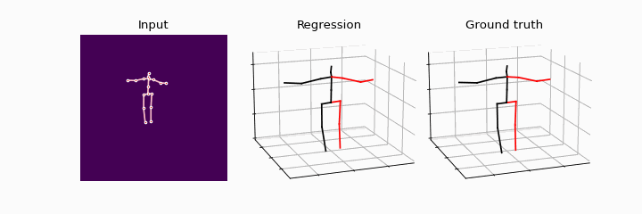
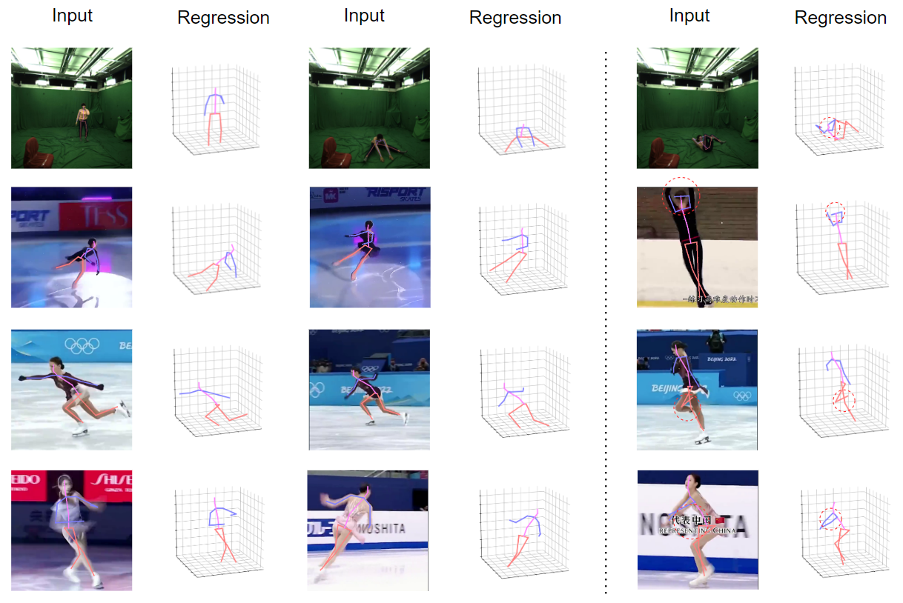

# ICFNet: Interactive-Complementary Fusion Network for Monocular 3D Human Pose Estimation

A 3D HPE Method In Monocular Image.
***

***

## install
`pip install -r requirements.txt`

## dataset
Please download the dataset from [Human3.6M](http://vision.imar.ro/human3.6m/) website and [MPI-INF-3DHP](https://vcai.mpi-inf.mpg.de/3dhp-dataset/) website, and refer to [VideoPose3D](https://github.com/facebookresearch/VideoPose3D) to set up the Human3.6M dataset ('./dataset' directory). Or you can download the processed data from [here](https://drive.google.com/drive/folders/18mvXIZ98LKGAqDFpRsNVvCRonVBAlgoX?usp=share_link). 


## train
to train a model in Human 3.6M dataset:
``` bash
python main.py --frames 1 --batch_size 1024
# train a refine model
python main.py --frames 1 --batch_size 1024 --refine --lr 1e-3 --previous_dir [xxx: your best model path]
# trian a gt model
python main.py --frames 1 --batch_size 1024 --previous_dir checkpoint/[xxx: your best model path] --keypoints gt --lr 0.001
```
## test
to train a model in Human 3.6M Dataset:
``` bash
# test the model, here need "".
python main.py --test --previous_dir "checkpoint/[xxx: your best model path]" --frames 1
# test the refine model
python main.py --test --previous_dir "checkpoint/[xxx: your best refine module path]" --frames 1 --refine --refine_reload
# test the gt model
python main.py --test --previous_dir "checkpoint/[xxx: your best gt model path]" --frames 1 --keypoints gt
```
to test a model in MPI-INF-3DHP Dataset:
``` bash
python main.py --test --previous_dir "checkpoint/[xxx: your best model path]" --frames 1 --dataset "3dhp" --batch_size 1
```
## Demo
First, you need to download YOLOv3 and HRNet pretrained models [here](https://drive.google.com/drive/folders/1_ENAMOsPM7FXmdYRbkwbFHgzQq_B_NQA?usp=sharing) and put it in the './demo/lib/checkpoint' directory.  Then, put your videos in the './demo/video' directory. Last, run the command below:
```bash
python demo/vis.py --video sample_video
```
## Acknowledgement

Our code is extended from the following repositories. We thank the authors for releasing the codes. 
- [MHFormer](https://github.com/Vegetebird/MHFormer)
- [VideoPose3D](https://github.com/facebookresearch/VideoPose3D)
- [GraphMLP](https://github.com/facebookresearch/VideoPose3D)

***


***
This link contains the code that supports our latest work: [MA-LCF](https://github.com/PENG-LAU/MA-LCF).